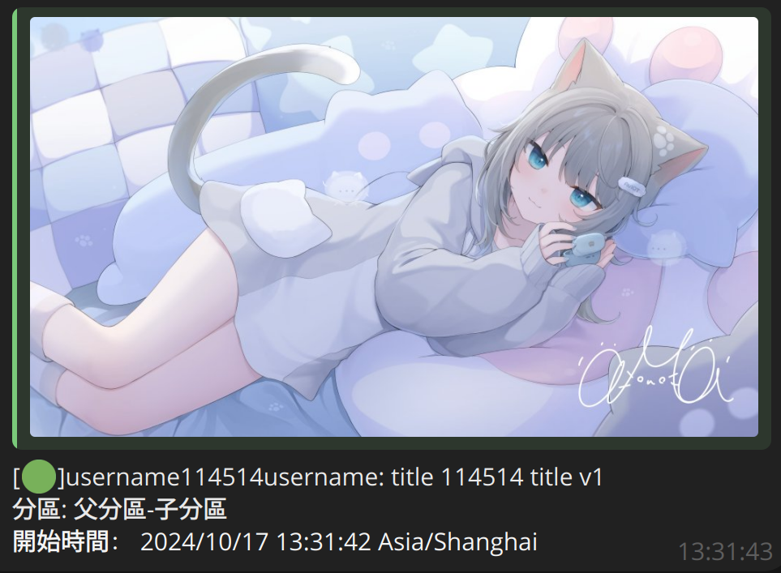
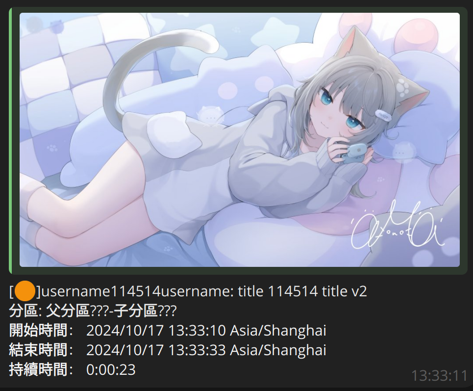

*：你覺得你是？？的腦殘粉嗎*

*「我覺得我是」*

# Bilibili Live Notification Bot

Telegram bilibili直播開播提醒bot 


## 功能

- 開播提醒，提示當前直播狀態，標題/分區發生變化時自動更新

- 自動刪除無效的關注直播間

- 記錄開播時間、結束時間和直播時長
 
<p align="center">

</p>

- 列出提醒列表，樣式如下：

`/list`：

```
[🟠]未開播: 直播間 114: (這裡是主播名稱)
[🟢]直播中: 直播間 514: (這裡是主播名稱)
[❓]未知: 直播間 1919
```

標記為未知的是直播間加入了提醒列表，但還未進行過任何一次狀態查詢。

除此之外，bot也提供了一些其他命令，詳見help：

`/start`：

```
Bilibili live notification bot 已啟動。
輸入 /subscribe room_id 以添加提醒的直播間；
輸入 /list 以列出加入提醒列表的直播間；
輸入 /unsubscribe room_id 以將直播間移出提醒列表；
輸入 /interval 以顯示輪詢完整提醒列表的間隔，
輸入 /interval number_int 以修改這一間隔；
輸入 /echo 以查看bot是否在運行
```

**注意：你需要向bot發送`/start`後才能接收到提醒消息。**

## 安裝&&部署

### 使用docker-compose

1. clone本倉庫

2. 配置參數。

參考下方的[第四節](#config)，複製出一份`config.json`，或者，如果使用environment variables的話，複製出一份`env_file.example`，重命名為`env_file`，並添加配置。

3. 啟動container

如果使用`config.json`： `sudo docker-compose up -d`

如果使用`env_file`： `sudo docker-compose --env-file ./env_file up -d`

### 直接部署在本地。

需要使用python 3.12。

1. clone本倉庫

2. 創建venv並啟用：

`python -m venv .env`

`source .env/bin/activate`

3. 安裝依賴：

`pip install -r requirements.txt`

4. 配置參數： 
<a name="config"></a>

可以使用`config.json`，或是environment variables。**當environment variables條目存在時，總是優先於`config.json`而生效。**

- `config.json`：

複製出一份`config.example.json`，重命名為`config.json`：

`cp config.example.json config.json`

然後依照下面的提示填寫參數：

```json
{
    "tgbot_token": "114514:aabbccdd",
    // 這個是你的telegram bot的token

    "tg_chat_id": "114514",
    // 這個是bot將會發送開播提醒的對象的chat id，就填寫自己tg的那一串唯一數字id好了，反正我也沒考慮過其他用法（劃掉

    "timezone": "Asia/Shanghai",
    // 用於指定開播提醒中時間的時區，可選參數列表參見pytz timezone list

    "poll_interval": 10,
    // 輪詢間隔，用於指定 完整查詢一輪所有關注了的直播間的狀態間 的間隔，單位：秒
    // 實際查詢的間隔還會因bilibili api的rate limit而受限

    "subscribed_rooms": [
        "114",
        "1", 
        "3"
    ]
    // 關注的直播間的列表，對應於live.bilibili.com/後面的一串數字
    // 只有一個關注時可以只填入單一string
}
```

- environment variables

參考`env_file.example`。格式為`BILILIVENOTIBOT_` + 上面json中所有出現字段的大寫，如下：

`BILILIVENOTIBOT_TGBOT_TOKEN`

`BILILIVENOTIBOT_TG_CHAT_ID`

`BILILIVENOTIBOT_TIMEZONE`

`BILILIVENOTIBOT_POLL_INTERVAL`

`BILILIVENOTIBOT_SUBSCRIBED_ROOMS`  (多個直播間用`,`分隔開)

5. 啟動

`python -m bili_live_noti_bot`
